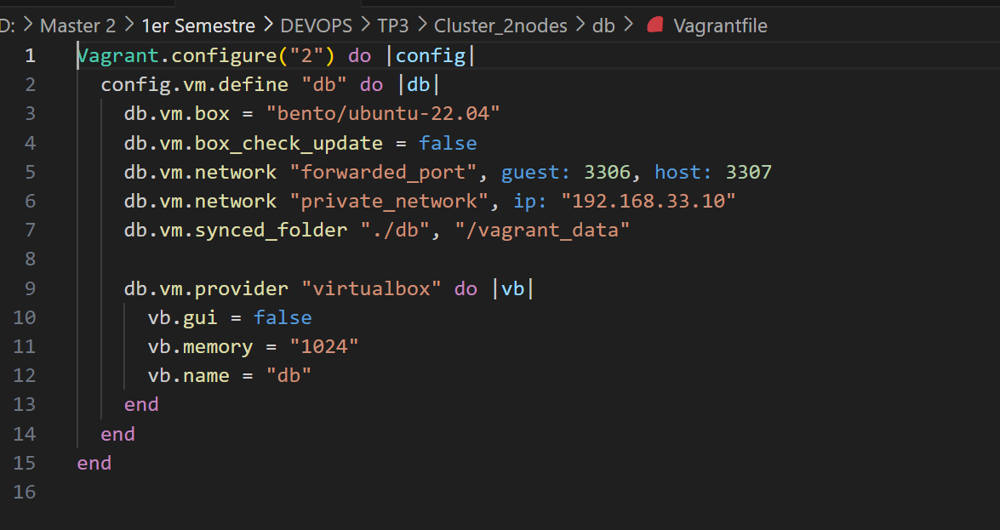

# TP3: Mise en place d'un cluster de 2 nodes

## Description

Ce projet consiste en la mise en place d'un cluster de 2 machines virtuelles (VM) configurées via **Vagrant**. <br>
Ces machines seront utilisées pour déployer une application Spring Boot sur le serveur **web** et 
une base de données MySQL sur le serveur **db**.  <br>
Le projet utilise **Node.js** pour démarrer un serveur sur le port 8086 et tester l'intégration avec la base de données MySQL.

## Prérequis

Avant de commencer, assurez-vous d'avoir installé les outils suivants :
- [Vagrant](https://www.vagrantup.com/)
- [VirtualBox](https://www.virtualbox.org/)
- [Node.js](https://nodejs.org/)


### 1. Création des machines virtuelles

- Créez 2 dossiers pour les machines : `web` et `db`.

- Utilisez **Vagrant** pour configurer les machines virtuelles.
   #### - Pour db: 
    
    ### - Pour web:
    

### 2. Configuration des machines:
#### Pour Web:  
 

#### Pour db :  


### 3. Démarrez les machines Web et Db:
```sh
vagrant up
```
#### 💡 Cela lance la VM.


### 4.  Clonez le projet Spring Boot sur la machine web ::
```sh
git clone https://github.com/ngorseck/admin-app.git
cd admin-app
```


### 4. Changez le port en 8086 :


### 5. Configuration la machine Web:
#### Sur la machine Web: :
```sh
sudo apt update

```

### Installez Node.js sur la machine web :
```sh
curl -fsSL https://raw.githubusercontent.com/nvm-sh/nvm/v0.39.4/install.sh | bash
nvm install --lts
nvm use --lts
```
#### Vérifiez l'installation :
```sh
node -v
npm -v
```


### 6.Test de l'interconnexion
#### Ping entre les machines :
```sh
ping 192.168.33.10  # Depuis web vers db
ping 192.168.33.11  # Depuis db vers web
```


### 6.Installer install
#### Sur la machine Web, installer jdk la version 17:
```sh
sudo apt install -y openjdk-17-jdk
```

#### Sur la machine Web, installer git:

#### Sur la machine Web, installer maven:
```sh
sudo apt update
sudo apt install -y maven
```


### 7. Configuration de la base de données MySQL :
#### Sur la machine db :
```sh
sudo apt update
sudo apt install mysql-server -y
```


#### Créer la base de données : Connectez-vous à MySQL en tant qu'utilisateur root :

#### Maintenant on cree un utilisateur:
```sh
CREATE USER 'user'@'%' IDENTIFIED BY 'user123'; 
```

```sh
grant all privileges on adminapp_db.* to 'user'@'%' with grant option;
FLUSH PRIVILEGES;
```


### 8. Configurer votre application.yml:


### 8. Déployer votre application:
```sh
mvn spring-boot:run -DskipTests
```

### Testons notre application sur postman:


